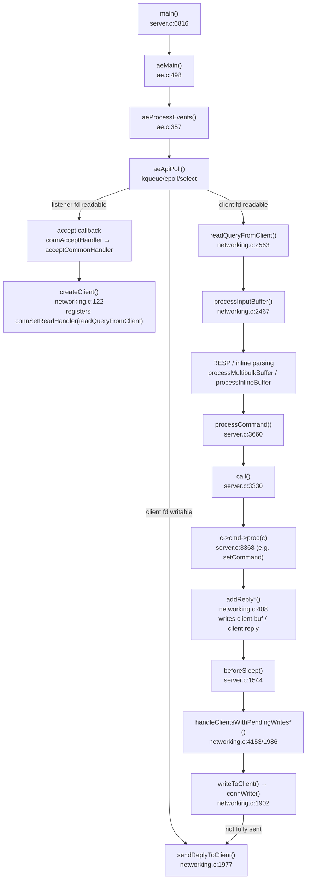
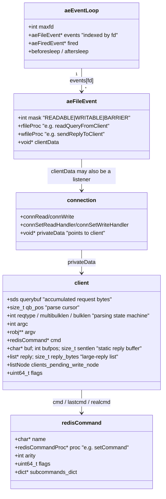
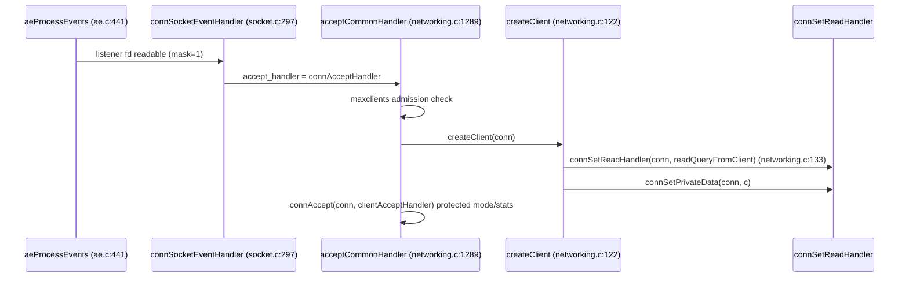
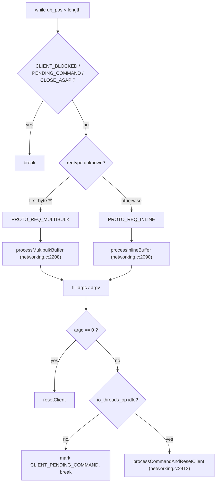
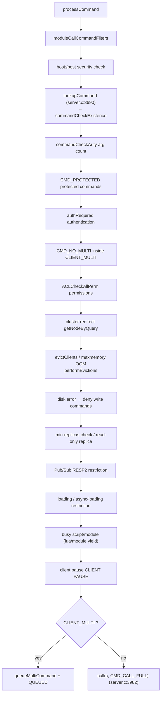
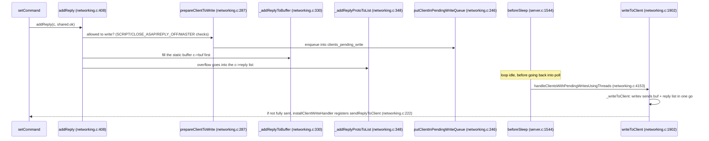

# How Redis Processes a Client Request — Code Reading Report

> **This report was produced by the [how-to-read-code](https://github.com/lichuang/how-to-read-code) skill; line numbers and call stacks were manually verified against the source.**
> Trigger prompt: "Analyze the client request processing pipeline using the how-to-read-code workflow"
> Target repository: [redis/redis](https://github.com/redis/redis), `unstable` branch, commit `1f245638` (2023 / v7.1-era snapshot)
> Method: `how-to-read-code` (run it → clarify purpose → mainline vs subplot → horizontal/vertical → scenario analysis → data structures → questioning → report)
> One-sentence conclusion: the journey of a command is
> `aeProcessEvents` → (client fd readable) `readQueryFromClient` (fills querybuf) → `processInputBuffer` (RESP/Inline parsing into argv) → `processCommand` (~15 validation steps) → `call` → `c->cmd->proc(c)` (execution) → `addReply` (into buf/reply) → `writeToClient` in `beforeSleep` writes back to the socket.

---

## 1. Scope & run status (Phase 1/2)

**Purpose**: trace how a client command (e.g. `SET foo bar`) travels through the code — which functions and data structures — from the TCP byte stream to the response written back.

**Did it run?**: ✅ Yes. Built a single-process `redis-server` with `make noopt` (`-O0`, debug-friendly), verified PING/SET/GET over redis-cli, and captured real call stacks with lldb.

Environment workarounds needed to build this 2023 snapshot on Apple Silicon with a modern SDK:

```bash
# 1) Critical: the Homebrew GNU `ar` in PATH must be replaced by Apple's /usr/bin/ar,
#    otherwise the .a archives are GNU format and Apple's linker fails with
#    "archive member '/' not a mach-o file"
export PATH=/usr/bin:$PATH

# 2) The newer SDK removed stat64 and AvailabilityMacros doesn't expose the version
#    macros; paper over it with compile-time definitions
make noopt CFLAGS="-DMAC_OS_X_VERSION_10_6=1060 -Dstat64=stat -Dfstat64=fstat"

# 3) The main Makefile doesn't rebuild these deps; rebuild them manually with Apple's ar
make -C deps/hiredis CC=cc
make -C deps/lua/src macosx CC=cc
make -C deps/hdr_histogram CC=cc
make -C deps/fpconv CC=cc
```

Run verification:

```bash
./src/redis-server --port 7777 --save '' --appendonly no --daemonize yes
./src/redis-cli -p 7777 ping     # PONG
./src/redis-cli -p 7777 set foo bar   # OK
./src/redis-cli -p 7777 get foo       # "bar"
```

---

## 2. Horizontal: architecture overview (Phase 4)

Redis is a **single-threaded event-loop** server: all client requests are processed serially on the main thread; only **socket reads/writes** can be delegated to I/O threads.



**Layer map** (who owns what):

| Layer | Files | Responsibility | Mainline? |
|---|---|---|---|
| Event loop | `ae.c` / `ae.h` | fd multiplexing, callback dispatch | ✅ |
| Connection abstraction | `connection.h` / `socket.c` / `tls.c` | `connRead/Write/Accept/Set*Handler` | black box (interface layer) |
| Client state | `client` in `server.h` | querybuf / argv / reply / flags | ✅ |
| Protocol parsing | `networking.c` | byte stream → `argc/argv` | ✅ |
| Command dispatch | `server.c` | validation + execution + propagation | ✅ |
| Command implementations | `t_string.c` etc. | the actual business logic | black box |
| Reply path | `networking.c` | buffering + write back to socket | ✅ |

---

## 3. Core data structures (Phase 7)

Three structures carry the whole pipeline: the **event table**, the **connection abstraction**, and the **client state**.



Key insight: **`aeFileEvent.clientData` is the crux**. For the listener fd it points to `connListener`; for client fds it is set to `client*` via `connSetPrivateData` (inside `createClient`: `connSetPrivateData(conn, c)`). That is why `readQueryFromClient` opens with a single line — `client *c = connGetPrivateData(conn)` — to get the client back.

The `client` fields most relevant to request processing (`server.h:1097`):

| Field | Role |
|---|---|
| `sds querybuf` | raw request bytes accumulated from the socket |
| `size_t qb_pos` | parsing progress cursor |
| `int reqtype` | `PROTO_REQ_INLINE` / `PROTO_REQ_MULTIBULK` |
| `int multibulklen` | remaining params to read in a RESP multibulk |
| `long bulklen` | byte length of the current bulk param (`-1` = unknown) |
| `int argc` / `robj **argv` | parsed command arguments |
| `redisCommand *cmd/lastcmd/realcmd` | the matched command implementation |
| `char *buf` / `int bufpos` / `size_t sentlen` | static small-reply buffer and sent length |
| `list *reply` / `size_t reply_bytes` | linked list for large replies |
| `listNode clients_pending_write_node` | node used to enqueue the client for pending writes |
| `uint64_t flags` | `CLIENT_BLOCKED`, `CLIENT_PENDING_COMMAND`, etc. |

---

## 4. Vertical: the full journey of a command (Phase 4/5)

### 4.1 Ground truth: real call stack captured with lldb

Breakpoint at `processCommand`, client sends `SET k v`:

```
frame #0  processCommand(c=...)                       server.c:3661
frame #1  processCommandAndResetClient(c=...)         networking.c:2417
frame #2  processInputBuffer(c=...)                   networking.c:2521
frame #3  readQueryFromClient(conn=...)               networking.c:2657
frame #4  callHandler(conn, readQueryFromClient)      connhelpers.h:79
frame #5  connSocketEventHandler(..., mask=1)         socket.c:297
frame #6  aeProcessEvents(eventLoop, flags=27)        ae.c:441
frame #7  aeMain(eventLoop)                           ae.c:501
frame #8  main(argc, argv)                           server.c:6816
```

This stack alone is the skeleton of the whole mainline. Expanded stage by stage below.

### 4.2 Stage ① — accepting a connection (accept)



- The listener fd's accept callback is registered in `initServer` (`server.c:2414`):
  `createSocketAcceptHandler(listener, connAcceptHandler) → aeCreateFileEvent(..., AE_READABLE, accept_handler)` (`server.c:2276`).
- The `client` is allocated and initialized in `createClient` (`querybuf=sdsempty()`, `reply=listCreate()`, `argc=0`, etc., `networking.c:122-220`).
- **The read-callback binding happens right here**: `connSetReadHandler(conn, readQueryFromClient)`. From then on, whenever the fd is readable the event loop jumps straight to `readQueryFromClient`.
- `clientAcceptHandler` (`networking.c:1235`) handles protected-mode rejections, connection stats, and module events.

### 4.3 Stage ② — reading bytes (read)

`readQueryFromClient` (`networking.c:2563`):

1. `postponeClientRead(c)`: if I/O threads are enabled, hand off to the pending-read queue and let a thread read; this function returns early (`networking.c:2570`).
2. Compute `readlen`; for a big bulk (`PROTO_MBULK_BIG_ARG`), read only up to the current argument boundary to avoid over-reading (`networking.c:2582-2596`).
3. `connRead(c->conn, c->querybuf+qblen, readlen)` reads into `querybuf` (an sds) (`networking.c:2613`).
4. `nread==0` → client closed → `freeClientAsync`; `-1` with a dead connection → likewise freed asynchronously.
5. Update `lastinteraction` and `stat_net_input_bytes`; if `client_max_querybuf_len` is exceeded, error out and disconnect.

**Key point**: this stage only *accumulates* data; no parsing. `querybuf` grows incrementally and `qb_pos` tracks parsing progress. TCP segmentation is naturally absorbed — an incomplete command simply waits for the next read.

### 4.4 Stage ③ — parsing the protocol (parse)

`processInputBuffer` (`networking.c:2467`) is a `while(qb_pos < sdslen(querybuf))` loop that can chew through multiple pipelined commands in one pass:



- **RESP multibulk** (`processMultibulkBuffer`, `networking.c:2208`): parse `*N\r\n` into `multibulklen`, then loop over each `$len\r\n<bytes>\r\n`, wrapping every param into a `robj` in `argv`. Big args get an optimization: if the current bulk is the *only* thing left in `querybuf`, the sds is reused directly instead of copied (`networking.c:2337-2348`).
- **Inline protocol** (`processInlineBuffer`, `networking.c:2090`): `sdssplitargs` splits on spaces/quotes; mainly used by hand-typed `redis-cli` or telnet.
- Protocol errors (oversized/illegal lengths, unauthenticated big requests) go through `setProtocolError` (`networking.c:2168`) → sets `CLIENT_CLOSE_AFTER_REPLY`.
- After parsing, `argc==0` (e.g. a bare newline heartbeat) triggers `resetClient` to clear state; otherwise `processCommandAndResetClient`.

### 4.5 Stage ④ — validation and dispatch (processCommand)

`processCommandAndResetClient` (`networking.c:2413`) sets `server.current_client = c`, calls `processCommand`, and on success runs `commandProcessed(c)` plus memory stats (`updateClientMemUsage`).

`processCommand` (`server.c:3660`) is a **sequential validation chain**; any failure calls `rejectCommand` and returns without executing:



- `lookupCommand` (`server.c:3039`) → `lookupCommandLogic` (`server.c:3023`): look up `argv[0]` in the `server.commands` dict; if the command has a `subcommands_dict`, look up `argv[1]` as well (e.g. `CONFIG SET`, `CLIENT SETNAME`). The command table is defined by `commands.def` (generated by `utils/generate-command-code.py`).
- The validation flags `is_write_command` / `is_denyoom_command` etc. are not re-derived each time; they are pulled in one shot from `getCommandFlags(c)` into `cmd_flags` and tested bitwise (`server.c:3716-3731`) — a hot-path optimization.
- The `rejectCommand*` family (`server.c:3538+`) uniformly handles rejections: `flagTransaction` (dirty the MULTI), error stats, and writing the error reply.

### 4.6 Stage ⑤ — execution (call)

`call` (`server.c:3330`) is where execution actually happens:

1. Clears `CLIENT_FORCE_AOF/REPL/PREVENT_PROP`, handles nested calls / cached clocks (`updateCachedTimeWithUs`).
2. **`c->cmd->proc(c)` (`server.c:3368`) — invokes the concrete command implementation** (e.g. `setCommand`). This is the only place in the pipeline where business logic runs.
3. Computes `duration` (preferring the monotonic hardware clock); error stats (`incrCommandStatsOnError`); handles `CLIENT_CLOSE_AFTER_COMMAND`.
4. Slow log `slowlogPushCurrentCommand`, latency sampling `latencyAddSampleIfNeeded` (`server.c:3422-3431`).
5. **MONITOR** forwarding `replicationFeedMonitors` (`server.c:3438`).
6. **Command stats** (`cmd->microseconds`, `calls`, latency histogram).
7. **Propagation**: if `dirty` (the dataset changed), `alsoPropagate` to the AOF / replication streams (`server.c:3459-3489`).
8. Client-side caching `trackingRememberKeys` (read-only commands).
9. `afterCommand(c)` wrap-up; `server.stat_numcommands++` and memory peak recording.

### 4.7 Stage ⑥ — the reply path (reply) and write-back

The command implementation (e.g. `setCommand`) calls `addReply(c, shared.ok)` and friends; the chain is:



**The double-buffer design**:

- `c->buf` (static, `PROTO_REPLY_CHUNK_BYTES`) + `bufpos`: the vast majority of small replies (`+OK`, `:1`) are memcpy'd straight in — zero malloc.
- `c->reply` (linked list + `reply_bytes`): large replies overflow to the list; at write time `writev` (`_writevToClient`) coalesces them, reducing syscalls and TCP packets.
- **Deferred writes**: `addReply` only enqueues the client into `clients_pending_write`; it does **not** immediately register a writable event. At the end of the event iteration, `beforeSleep` flushes everyone (`handleClientsWithPendingWrites`, `networking.c:1986`). Only if a socket couldn't be fully drained does `installClientWriteHandler` register `sendReplyToClient` (`networking.c:222`) — this is exactly the `fsync=always` barrier described by the `AE_BARRIER` comment at `ae.c:432`.
- The write cap `NET_MAX_WRITES_PER_EVENT` (`networking.c:1924`): one client cannot monopolize a single event iteration, preventing huge replies from starving others.
- Output-buffer overflow is handled by `closeClientOnOutputBufferLimitReached` (`networking.c:380`).
- At the end of `writeToClient`, if `CLIENT_CLOSE_AFTER_REPLY` is set, the connection is freed asynchronously (`networking.c:1963`).

### 4.8 Event-loop scheduling (ae.c)

Each iteration of `aeProcessEvents` (`ae.c:357`):

1. Compute the timeout until the nearest timer to decide how long `poll` may block.
2. Call `eventLoop->beforesleep` (i.e. `beforeSleep`, `ae.c:399`).
3. `aeApiPoll` blocks waiting for fd events.
4. Call `aftersleep`.
5. Iterate `fired[]`: **reads before writes** by default; if the event carries `AE_BARRIER`, the order is inverted to "writes before reads" (`ae.c:432-464`). The read callback is `readQueryFromClient`.
6. `processTimeEvents` runs timers (e.g. `serverCron`).

`aeMain` (`ae.c:498`) is just `while(!stop) aeProcessEvents(AE_ALL_EVENTS|AE_CALL_BEFORE_SLEEP|AE_CALL_AFTER_SLEEP)`.

`beforeSleep` (`server.c:1544`), before every entry into `poll`, in order: blocked-timeout check → pending-read thread reads → TLS pending data → cluster beforeSleep → fast expiry cycle → WAIT/module unblocks → process unblocked clients → client-tracking invalidation broadcasts → **flush AOF** → **`handleClientsWithPendingWritesUsingThreads` write-back** → async client frees → trim replication backlog.

---

## 5. Black boxes deliberately left closed (Phase 3)

| Black box | Interface | Why not opened |
|---|---|---|
| `connection` abstraction / `socket.c`/`tls.c` | `connRead/Write/Accept/Set*Handler` | flow is the goal, not TLS/Unix-socket differences |
| `aeApiPoll` backends | kqueue(BSD)/epoll(Linux)/select | platform mechanics, not request-processing logic |
| `sds` dynamic strings | `sdsMakeRoomFor` etc. | standalone library; treat as a growable byte array |
| `dict` command table | `dictFetchValue(server.commands, name)` | hash-table internals are irrelevant to the flow |
| Individual command implementations | `c->cmd->proc(c)` | one black box per command; only the entry point matters here |
| ACL / Cluster / replication buffers | `ACLCheckAllPerm` etc. | branches of `processCommand`, not the trunk |
| I/O-thread reads | `handleClientsWithPendingReadsUsingThreads` | parallel path; the single-threaded version suffices |

---

## 6. Design questions & tradeoffs (Phase 8)

**Q1: Why a single-threaded event loop? No parallel command execution?**
Commands read and write a shared dataset; locking costs and complexity outweigh the benefit. Redis trades "single-threaded serialization" for lock-free data structures and predictable latency. Only pure I/O (socket read/write, protocol parsing) parallelizes well — hence `io_threads` accelerate only send/receive.

**Q2: Why two reply mechanisms — a static buf plus a list?**
Small replies go through the static buf, avoiding malloc churn (this is nearly all traffic); large replies overflow to the list, avoiding repeated buffer growth and copies; at send time `writev` coalesces both heads into few syscalls. A classic "specialize the fast path, generalize the slow path" trade.

**Q3: Why doesn't addReply register a writable event immediately?**
One event-loop iteration can produce a flood of replies; doing epoll_ctl per reply is syscall-expensive. Instead the client is enqueued in `pending_write`, and `beforeSleep` first tries a **synchronous direct write**, registering an event only if the socket couldn't absorb everything — one attempt replaces most event registrations.

**Q4: Is the processCommand validation chain too long? Would I do it differently?**
It is already long (auth/ACL/cluster/OOM/disk/pause…), and every feature appends another block. I would consider splitting it into a data-driven chain of validator entries. But caveat: this is an extreme hot path; an array of function pointers adds indirect-call overhead. Redis's compile-time straight-line branches are a deliberate performance choice — **readability vs. performance is an explicit trade here**.

**Q5: Why is reqtype detected lazily?**
It only inspects the first byte when `!c->reqtype`, avoiding a re-check per command; and the parse state (`multibulklen`/`bulklen`) persists across reads, naturally tolerating TCP segmentation.

**Q6: Why align "big bulk" to an sds boundary?**
In `processMultibulkBuffer`, if the current bulk is all that remains in querybuf, `sdsrange` shifts the leading data away and the whole sds is reused as the `robj` (`networking.c:2298-2318`, `2337-2348`). Reading large values then skips a large copy — a classic memory/CPU trade, paid for with a few extra `read(2)` calls.

---

## 7. Open questions / suggested follow-ups (Phase 9)

1. **I/O-thread path**: `handleClientsWithPendingReadsUsingThreads` + `CLIENT_PENDING_COMMAND` parallel protocol reading was not deeply verified; worth its own read.
2. **Blocked clients**: `CLIENT_BLOCKED`, `blockClient`, `processUnblockedClients` cause the early `break` in `processInputBuffer`; involves BLPOP/WAIT etc., not expanded here.
3. **Replica path**: `CLIENT_TYPE_SLAVE` replies go through the global `repl_buffer_blocks` (see the slave branch in `_writeToClient` and `clientHasPendingReplies`) — entirely different from normal clients.
4. The debug environment is already built (`redis-server` compiled): run breakpoints on `BLPOP`, `SUBSCRIBE`, pipelines, and oversized values to cover the three edge scenarios above.

---

## Appendix: key function index

| Stage | Function | Location |
|---|---|---|
| Startup | `main` → `aeMain` | `server.c:6816` / `ae.c:498` |
| Event loop | `aeProcessEvents` | `ae.c:357` |
| Listener registration | `createSocketAcceptHandler` / `aeCreateFileEvent` | `server.c:2272` / `ae.c:158` |
| Accept | `acceptCommonHandler` | `networking.c:1289` |
| Client creation | `createClient` | `networking.c:122` |
| Read | `readQueryFromClient` | `networking.c:2563` |
| Parse loop | `processInputBuffer` | `networking.c:2467` |
| RESP parsing | `processMultibulkBuffer` | `networking.c:2208` |
| Inline parsing | `processInlineBuffer` | `networking.c:2090` |
| Dispatch | `processCommandAndResetClient` / `processCommand` | `networking.c:2413` / `server.c:3660` |
| Command lookup | `lookupCommand` / `lookupCommandLogic` | `server.c:3039` / `server.c:3023` |
| Execution | `call` / `c->cmd->proc(c)` | `server.c:3330` / `server.c:3368` |
| Reply buffering | `addReply` / `prepareClientToWrite` | `networking.c:408` / `networking.c:287` |
| Reply to socket | `writeToClient` / `_writeToClient` / `sendReplyToClient` | `networking.c:1902` / `1841` / `1977` |
| Iteration wrap-up | `beforeSleep` | `server.c:1544` |