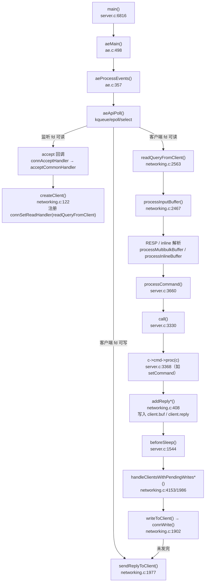
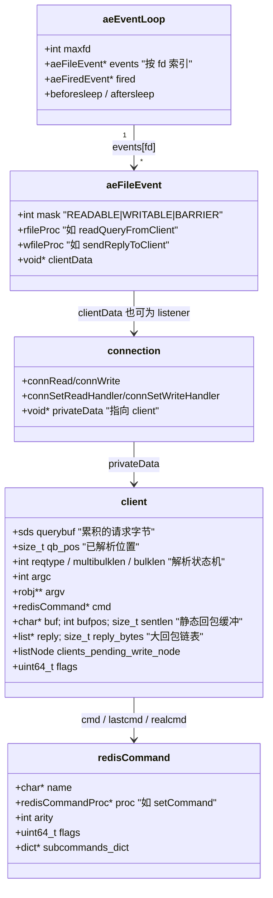
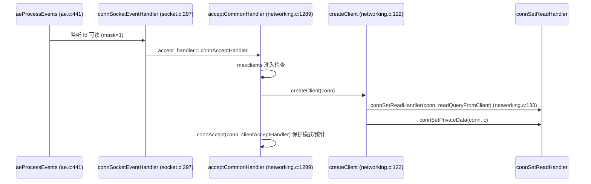
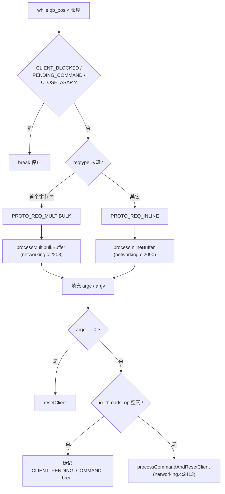
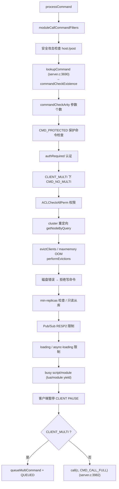
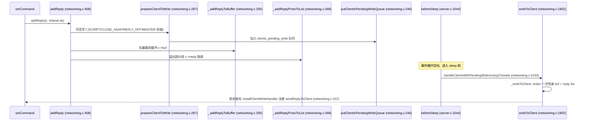

# Redis 客户端请求处理流程 — 读码报告

> **本报告由 [how-to-read-code](https://github.com/lichuang/how-to-read-code) skill 生成，行号与调用栈经人工比对源码核验。**
> 触发提示词：「用 how-to-read-code 的方式分析 处理客户端请求的流程」
> 目标仓库：[redis/redis](https://github.com/redis/redis) `unstable` 分支，commit `1f245638`（2023 年 / v7.1 时代快照）
> 方法：`how-to-read-code`（跑起来 → 定目的 → 分主线 → 横纵交替 → 情景分析 → 数据结构 → 提问 → 报告）
> 结论一句话：一条命令的旅程是
> `aeProcessEvents` →（客户端 fd 可读）`readQueryFromClient`（读入 querybuf）→ `processInputBuffer`（RESP/Inline 解析成 argv）→ `processCommand`（约 15 步校验）→ `call` → `c->cmd->proc(c)`（执行）→ `addReply`（入 buf/reply）→ `beforeSleep` 里 `writeToClient` 写回 socket。

---

## 1. Scope & 运行情况（Phase 1/2）

**目的**：搞清楚一条客户端命令（如 `SET foo bar`）从 TCP 字节流到写回应答，在代码里经过哪些函数、哪些数据结构。

**是否跑起来**：✅ 是。用 `make noopt`（`-O0`，便于调试）编译出单进程 `redis-server`，实测 PING/SET/GET 正常，并用 lldb 抓到了真实调用栈。

复现所需的环境兼容处理（Apple Silicon + 新 SDK 编译该 2023 年快照）：

```bash
# 1) 关键：PATH 里的 Homebrew GNU `ar` 必须换成 Apple 的 /usr/bin/ar
#    否则生成的 .a 是 GNU 格式，Apple 链接器报 "archive member '/' not a mach-o file"
export PATH=/usr/bin:$PATH

# 2) 新 SDK 移除了 stat64，且 AvailabilityMacros 未暴露版本宏，用编译开关补齐
make noopt CFLAGS="-DMAC_OS_X_VERSION_10_6=1060 -Dstat64=stat -Dfstat64=fstat"

# 3) 主 Makefile 不会重建这几个 dep，需手动用 Apple ar 重编
make -C deps/hiredis CC=cc
make -C deps/lua/src macosx CC=cc
make -C deps/hdr_histogram CC=cc
make -C deps/fpconv CC=cc
```

运行验证：

```bash
./src/redis-server --port 7777 --save '' --appendonly no --daemonize yes
./src/redis-cli -p 7777 ping     # PONG
./src/redis-cli -p 7777 set foo bar   # OK
./src/redis-cli -p 7777 get foo       # "bar"
```

---

## 2. 横向架构总览（Phase 4）

Redis 是**单线程事件循环**服务器，所有客户端请求都在主线程串行处理；只有**读 socket / 写 socket** 可下放到 I/O 线程。



**分层对照**（哪一层管什么）：

| 层 | 文件 | 职责 | 是否主线 |
|---|---|---|---|
| 事件循环 | `ae.c` / `ae.h` | fd 多路复用、回调派发 | ✅ |
| 连接抽象 | `connection.h` / `socket.c` / `tls.c` | `connRead/Write/Accept/Set*Handler` | 黑盒（接口层） |
| 客户端状态 | `server.h` `client` | querybuf / argv / reply / flags | ✅ |
| 协议解析 | `networking.c` | 字节流 → `argc/argv` | ✅ |
| 命令派发 | `server.c` | 校验 + 执行 + 传播 | ✅ |
| 命令实现 | `t_string.c` 等 | 具体业务 | 黑盒 |
| 回包 | `networking.c` | 缓冲 + 发回 socket | ✅ |

---

## 3. 核心数据结构（Phase 7）

三个结构撑起整条流水线：**事件表**、**连接抽象**、**客户端状态**。



关键点：**`aeFileEvent.clientData` 是关键纽带**。对监听 fd，它指向 `connListener`；对客户端 fd，它在 `connSetPrivateData` 时被设为 `client*`（`createClient` 里 `connSetPrivateData(conn, c)`）。所以 `readQueryFromClient` 开头一句 `client *c = connGetPrivateData(conn)` 就能拿回 client。

`client` 结构中与请求处理最相关的字段（`server.h:1097`）：

| 字段 | 作用 |
|---|---|
| `sds querybuf` | 从 socket 累积的原始请求字节 |
| `size_t qb_pos` | 解析进度游标 |
| `int reqtype` | `PROTO_REQ_INLINE` / `PROTO_REQ_MULTIBULK` |
| `int multibulklen` | RESP 中剩余待读参数个数 |
| `long bulklen` | 当前 bulk 参数的字节长度（`-1` 表示未知） |
| `int argc` / `robj **argv` | 解析出的命令参数 |
| `redisCommand *cmd/lastcmd/realcmd` | 命中的命令实现 |
| `char *buf` / `int bufpos` / `size_t sentlen` | 静态小回包缓冲与已发长度 |
| `list *reply` / `size_t reply_bytes` | 大回包链表 |
| `listNode clients_pending_write_node` | 挂入待写队列的节点 |
| `uint64_t flags` | `CLIENT_BLOCKED`、`CLIENT_PENDING_COMMAND` 等状态 |

---

## 4. 纵向：一条命令的完整旅程（Phase 4/5）

### 4.1 已用 lldb 实测的真实调用栈（Ground Truth）

在 `processCommand` 下断点，客户端发 `SET k v`，捕获到：

```
frame #0  processCommand(c=...)                       server.c:3661
frame #1  processCommandAndResetClient(c=...)         networking.c:2417
frame #2  processInputBuffer(c=...)                   networking.c:2521
frame #3  readQueryFromClient(conn=...)               networking.c:2657
frame #4  callHandler(conn, readQueryFromClient)      connhelpers.h:79
frame #5  connSocketEventHandler(..., mask=1)         socket.c:297
frame #6  aeProcessEvents(eventLoop, flags=27)        ae.c:441
frame #7  aeMain(eventLoop)                           ae.c:501
frame #8  main(argc, argv)                           server.c:6816
```

这条栈本身就是整条主线的骨架。下面按阶段展开。

### 4.2 阶段① 接入连接（accept）



- 监听 fd 的接受回调是在 `initServer`（`server.c:2414`）里注册的：
  `createSocketAcceptHandler(listener, connAcceptHandler) → aeCreateFileEvent(..., AE_READABLE, accept_handler)`（`server.c:2276`）。
- `client` 在 `createClient` 中被分配并初始化（`querybuf=sdsempty()`、`reply=listCreate()`、`argc=0` 等，`networking.c:122-220`）。
- **此处就完成了读回调的绑定**：`connSetReadHandler(conn, readQueryFromClient)`。之后该 fd 一旦可读，事件循环就直接跳到 `readQueryFromClient`。
- `clientAcceptHandler`（`networking.c:1235`）处理保护模式拒绝、连接统计、模块事件。

### 4.3 阶段② 读取字节（read）

`readQueryFromClient`（`networking.c:2563`）：

1. `postponeClientRead(c)`：若开了 I/O 线程，投递到 pending-read 队列交给线程读，本函数直接返回（`networking.c:2570`）。
2. 计算 `readlen`；若是大 bulk（`PROTO_MBULK_BIG_ARG`），只读到当前参数边界，减少多余读（`networking.c:2582-2596`）。
3. `connRead(c->conn, c->querybuf+qblen, readlen)` 读入 `querybuf`（sds）（`networking.c:2613`）。
4. `nread==0` → 客户端关闭 → `freeClientAsync`；`-1` 且连接已断 → 同样异步释放。
5. 更新 `lastinteraction`、`stat_net_input_bytes`；超过 `client_max_querybuf_len` 则报错断开。

**要点**：这里只做「攒数据」，不解析。`querybuf` 是增量累积的，`qb_pos` 标记解析进度。TCP 分包天然被容纳——不够一条完整命令就留着等下次 read。

### 4.4 阶段③ 解析协议（parse）

`processInputBuffer`（`networking.c:2467`）是一个 `while(qb_pos < sdslen(querybuf))` 循环，可一次处理多条 pipeline 命令：



- **RESP 多批量**（`processMultibulkBuffer`，`networking.c:2208`）：先解析 `*N\r\n` 得 `multibulklen`，再循环解析每个 `$len\r\n<bytes>\r\n`，把每个参数包成 `robj` 放进 `argv`。大参数有优化：若 `querybuf` 里恰好只有这个 bulk，则直接复用该 sds，避免拷贝（`networking.c:2337-2348`）。
- **Inline 协议**（`processInlineBuffer`，`networking.c:2090`）：`sdssplitargs` 按空格/引号切分，主要用于 `redis-cli` 手敲或 telnet。
- 协议错误（超大/非法长度、未认证就发大请求）走 `setProtocolError`（`networking.c:2168`）→ 标记 `CLIENT_CLOSE_AFTER_REPLY`。
- 解析完成后 `argc==0`（如只有换行的心跳）调用 `resetClient` 清状态；否则 `processCommandAndResetClient`。

### 4.5 阶段④ 命令校验与派发（processCommand）

`processCommandAndResetClient`（`networking.c:2413`）设置 `server.current_client = c`，调用 `processCommand`，成功后 `commandProcessed(c)` 并更新内存统计（`updateClientMemUsage`）。

`processCommand`（`server.c:3660`）是一条**顺序校验链**，任何一步失败就 `rejectCommand` 并返回（不执行）：



- `lookupCommand`（`server.c:3039`）→ `lookupCommandLogic`（`server.c:3023`）：先在 `server.commands` dict 里查 `argv[0]`，若命令有 `subcommands_dict` 则再查 `argv[1]`（如 `CONFIG SET`、`CLIENT SETNAME`）。命令表由 `commands.def`（`utils/generate-command-code.py` 生成）定义。
- 校验用的 `is_write_command` / `is_denyoom_command` 等并非现查，而是从 `getCommandFlags(c)` 一次性取出 `cmd_flags` 后位运算判断（`server.c:3716-3731`），是热路径优化。
- `rejectCommand*` 系列（`server.c:3538+`）统一处理拒绝：`flagTransaction`（MULTI 置脏）、错误统计、写错误回复。

### 4.6 阶段⑤ 执行（call）

`call`（`server.c:3330`）是「真正执行」的入口：

1. 清 `CLIENT_FORCE_AOF/REPL/PREVENT_PROP`，处理嵌套调用/时钟缓存（`updateCachedTimeWithUs`）。
2. **`c->cmd->proc(c)`（`server.c:3368`）——调用具体命令实现**（如 `setCommand`）。这是整个流水线唯一执行业务逻辑的地方。
3. 计算耗时 `duration`（优先用硬件单调时钟）；错误统计（`incrCommandStatsOnError`）；`CLIENT_CLOSE_AFTER_COMMAND` 处理。
4. 慢查询 `slowlogPushCurrentCommand`、延迟采样 `latencyAddSampleIfNeeded`（`server.c:3422-3431`）。
5. **MONITOR** 转发 `replicationFeedMonitors`（`server.c:3438`）。
6. **命令统计**（`cmd->microseconds`、`calls`、latency histogram）。
7. **传播**：若 `dirty`（数据集被改），`alsoPropagate` 到 AOF / 复制流（`server.c:3459-3489`）。
8. 客户端侧缓存 `trackingRememberKeys`（只读命令）。
9. `afterCommand(c)` 收尾；`server.stat_numcommands++` 与内存峰值记录。

### 4.7 阶段⑥ 回包（reply）与写回

命令实现（如 `setCommand`）内部调用 `addReply(c, shared.ok)` 之类，链路：



**双缓冲设计**：

- `c->buf`（静态，`PROTO_REPLY_CHUNK_BYTES`）+ `bufpos`：绝大多数小回复（`+OK`、`:1`）直接 memcpy 进去，零 malloc。
- `c->reply`（链表 + `reply_bytes`）：大回复溢出到链表，写时用 `writev`（`_writevToClient`）合并发送，减少系统调用与 TCP 包。
- **延迟写**：`addReply` 只把 client 挂到 `clients_pending_write` 队列，**不立刻注册可写事件**；等到本轮事件处理结束、`beforeSleep` 时统一 flush（`handleClientsWithPendingWrites`，`networking.c:1986`）。若一次没写完，才 `installClientWriteHandler` 注册 `sendReplyToClient`（`networking.c:222`）——这正是 `ae.c:432` 里 `AE_BARRIER` 注释所说的 `fsync=always` 屏障来源。
- 写量上限 `NET_MAX_WRITES_PER_EVENT`（`networking.c:1924`）：单次事件不让某客户端独占，避免大回复饿死其他客户端。
- 输出缓冲超限由 `closeClientOnOutputBufferLimitReached` 处理（`networking.c:380`）。
- `writeToClient` 结束时若 `CLIENT_CLOSE_AFTER_REPLY` 置位，异步释放连接（`networking.c:1963`）。

### 4.8 事件循环调度（ae.c）

`aeProcessEvents`（`ae.c:357`）每次迭代：

1. 计算到最近 timer 的超时，决定 `poll` 阻塞时长。
2. 调用 `eventLoop->beforesleep`（即 `beforeSleep`，`ae.c:399`）。
3. `aeApiPoll` 阻塞等待 fd 事件。
4. 调用 `aftersleep`。
5. 遍历 `fired[]`：默认**先读后写**；若事件带 `AE_BARRIER` 则反转为「先写后读」（`ae.c:432-464`）。读回调即 `readQueryFromClient`。
6. `processTimeEvents` 处理定时器（如 `serverCron`）。

`aeMain`（`ae.c:498`）就是 `while(!stop) aeProcessEvents(AE_ALL_EVENTS|AE_CALL_BEFORE_SLEEP|AE_CALL_AFTER_SLEEP)`。

`beforeSleep`（`server.c:1544`）在每次进入 `poll` 前依次做：阻塞超时检查 → pending-read 线程读取 → TLS pending data → 集群 beforeSleep → 快速过期周期 → 处理 WAIT/模块阻塞 → 处理未阻塞客户端 → 客户端缓存失效广播 → **flush AOF** → **`handleClientsWithPendingWritesUsingThreads` 回写** → 异步释放客户 → 修剪复制积压。

---

## 5. 主动留下的黑盒（Phase 3）

| 黑盒 | 接口 | 为何不展开 |
|---|---|---|
| `connection` 抽象 / `socket.c`/`tls.c` | `connRead/Write/Accept/Set*Handler` | 本次只关心流程，不关心 TLS/Unix socket 差异 |
| `aeApiPoll` 后端 | kqueue(BSD)/epoll(Linux)/select | 平台机制，非请求处理逻辑 |
| `sds` 动态字符串 | `sdsMakeRoomFor` 等 | 独立库，当作「可增长字节数组」 |
| `dict` 命令表 | `dictFetchValue(server.commands, name)` | 哈希表实现与流程无关 |
| 具体命令实现 | `c->cmd->proc(c)` | 每个命令一个黑盒；本次只需知道入口 |
| ACL / Cluster / 复制缓冲 | `ACLCheckAllPerm` 等 | 是 `processCommand` 的分支，非主干 |
| I/O 线程读 | `handleClientsWithPendingReadsUsingThreads` | 并行路径，主流程的单线程版本已足够 |

---

## 6. 设计问题与权衡（Phase 8）

**Q1：为什么是单线程事件循环？不并行执行命令？**
因为命令会读写共享数据集，加锁成本与复杂度远超收益。Redis 用「单线程串行化」换来了无锁数据结构 + 可预测延迟。只有纯 I/O（socket read/write、协议解析）才是可并行的，所以才有 `io_threads` 仅加速收发。

**Q2：为什么回包用「静态 buf + 链表」两套？**
小回复走静态 buf 避免 malloc 抖动（这是绝大多数请求）；大回复走链表避免缓冲区反复扩容拷贝；发送时 `writev` 把两段合并成少数 syscall。典型的「快路径特化 + 慢路径通用」权衡。

**Q3：为什么 addReply 不马上注册可写事件？**
事件循环一次迭代里可能产生大量回复，如果每条都 epoll_ctl 增删可写事件，syscall 成本高。改为挂 `pending_write` 队列，`beforeSleep` 里先尝试**同步直写**，只有真的写不完才注册事件——用一次尝试换掉大部分事件注册。

**Q4：`processCommand` 校验链会否过长？换我会怎么做？**
它的校验链已经很长（认证/ACL/集群/OOM/磁盘/暂停……），每加一个特性就往里塞一段。我会考虑把它拆成「校验器数组/责任链」，用数据驱动注册，减少函数膨胀与分支耦合。但要注意：这是极致热路径，函数指针数组可能带来间接跳转开销，Redis 选择编译期直线分支是有性能理由的——**可读性与性能在此处是明确取舍**。

**Q5：`reqtype` 为什么延迟判定？**
只在 `!c->reqtype` 时看首字节决定 RESP/Inline，避免每条命令都判断；且解析状态（`multibulklen`/`bulklen`）跨多次 read 保留，天然支持 TCP 分包。

**Q6：为什么大 bulk 要「恰好对齐到 sds 边界」？**
`processMultibulkBuffer` 里若检测到 querybuf 中只剩当前 bulk，就 `sdsrange` 把前置数据移走并复用整个 sds 作为 `robj`（`networking.c:2298-2318`、`2337-2348`）。这样读取大 value 时省去一次大拷贝，是内存/CPU 权衡的经典手法，代价是可能多几次 `read(2)`。

---

## 7. 开放问题 / 建议后续（Phase 9）

1. **I/O 线程路径**：`handleClientsWithPendingReadsUsingThreads` + `CLIENT_PENDING_COMMAND` 的并行读协议未被深入验证，值得单独一读。
2. **阻塞客户端**：`CLIENT_BLOCKED`、`blockClient`、`processUnblockedClients` 是 `processInputBuffer` 提前 break 的原因，涉及 BLPOP/WAIT 等，未展开。
3. **从库/复制路径**：`CLIENT_TYPE_SLAVE` 的回包走全局 `repl_buffer_blocks`（见 `_writeToClient` 的 slave 分支与 `clientHasPendingReplies`），与普通客户端完全不同。
4. 可复用已搭好的调试环境（`redis-server` 已编译），对 `BLPOP`、`SUBSCRIBE`、pipeline、超大 value 各跑一次断点，即可补齐上面三条边界场景。

---

## 附录：关键函数索引

| 阶段 | 函数 | 位置 |
|---|---|---|
| 启动 | `main` → `aeMain` | `server.c:6816` / `ae.c:498` |
| 事件循环 | `aeProcessEvents` | `ae.c:357` |
| 注册监听 | `createSocketAcceptHandler` / `aeCreateFileEvent` | `server.c:2272` / `ae.c:158` |
| 接受连接 | `acceptCommonHandler` | `networking.c:1289` |
| 创建客户端 | `createClient` | `networking.c:122` |
| 读 | `readQueryFromClient` | `networking.c:2563` |
| 解析循环 | `processInputBuffer` | `networking.c:2467` |
| RESP 解析 | `processMultibulkBuffer` | `networking.c:2208` |
| Inline 解析 | `processInlineBuffer` | `networking.c:2090` |
| 派发 | `processCommandAndResetClient` / `processCommand` | `networking.c:2413` / `server.c:3660` |
| 命令查找 | `lookupCommand` / `lookupCommandLogic` | `server.c:3039` / `server.c:3023` |
| 执行 | `call` / `c->cmd->proc(c)` | `server.c:3330` / `server.c:3368` |
| 回包入缓冲 | `addReply` / `prepareClientToWrite` | `networking.c:408` / `networking.c:287` |
| 回包写 socket | `writeToClient` / `_writeToClient` / `sendReplyToClient` | `networking.c:1902` / `1841` / `1977` |
| 每轮收尾 | `beforeSleep` | `server.c:1544` |
