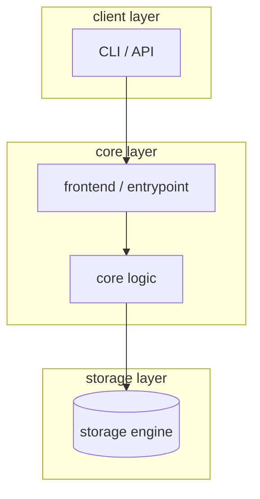
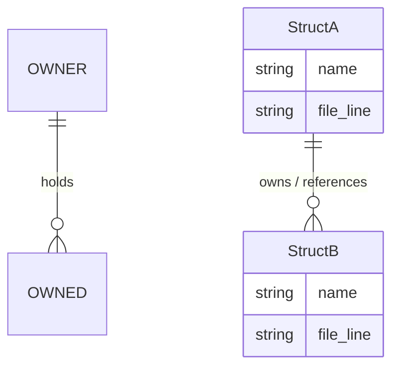
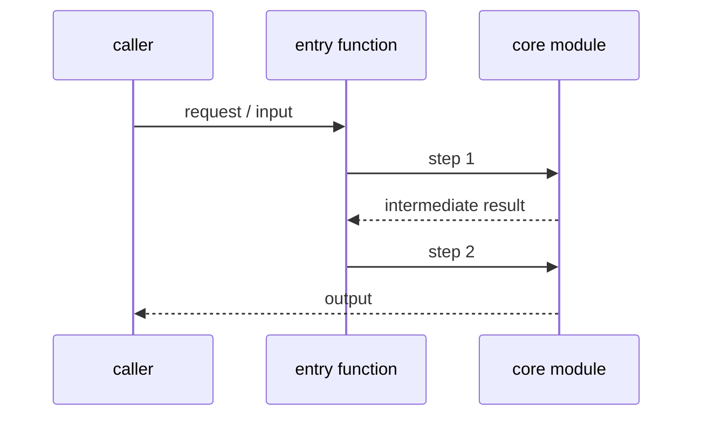

# Code Reading Report: {project/module name}

> Produced with the how-to-read-code workflow. Conclusion labels: **[verified]** = observed via execution/debug/test; **[static]** = inferred from reading only.

## 1. Scope & purpose

- **Purpose** (from Phase 2, user's words): {what the user wants to know}
- **Environment**: {did the project run locally? build command used; if not runnable, why and what fallback was used}
- **Out of scope**: {explicitly excluded areas}

## 2. Architecture overview (horizontal pass)

{2–5 paragraphs max. Name the top-level components and their responsibilities.}



> Placeholder diagram — replace nodes/edges with the project's actual components.

## 3. Core data structures & relationships

{The handful of core types that define the architecture. For each: who creates it, who holds it, who mutates it, lifetime.}

| Structure | Defined in | Created by | Held by | Mutated in | Role |
|---|---|---|---|---|---|
| {StructA} | {file:line} |  |  |  |  |



> Placeholder diagram — replace with the project's actual core structures and their ownership/lifetime relations.

## 4. Vertical analysis: {target flow name}

{Step-by-step narrative of the execution path, referencing file:line. Include the observed call path.}



> Placeholder diagram — replace with the project's actual call flow, annotated with file:line.

Observed path (from Phase 5 scenario):

```
{backtrace / log excerpt that grounds the narrative — keep short}
```

## 5. Black boxes (consciously not opened)

| Interface | Input | Output | Effect | Why not opened |
|---|---|---|---|---|
| {func/class} |  |  |  | {subplot rationale} |

## 6. Design commentary & open questions (Phase 8)

- {Why this data structure/algorithm was chosen; how comparable projects solve the same problem}
- {What I would design differently, and why — at least one entry required}
- {Suspicious findings: dead code, duplication, missing error handling}

## 7. Follow-ups

- [ ] {possible deeper dives, unopened black boxes worth opening later, scenarios not yet covered}